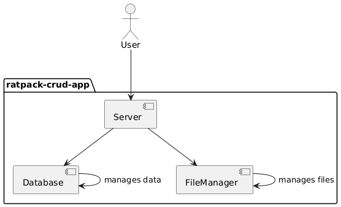

# ratpack-crud-app

This is a backend application for file sharing built with Java, Ratpack, and SQLite.

## Table of Contents

1. [Quick Start](#1-quick-start)
2. [System Design](#2-system-design)
3. [API Reference](#3-api-reference)

## 1. Quick Start

Build this jar with the gradle wrapper. Then run with a java runtime. The default build location is
`build/libs/`

```shell
$ ./gradlew jar
$ java -jar build/libs/ratpack-crud-app-1.0-SNAPSHOT.jar
```

or, immediately run

```shell
$ ./gradlew run
```

## 2. System Design

This app consists of 3 components, described by the image below.


### Summary of each component:

1. Server: a ratpack server that handles the user requests.
2. Database: interfaces with sqlite through JDBC (Java Database Connectivity).
3. FileManager: manages file creation, deletion.

## 3. API Reference

The reference to the API is available
through [Postman](https://www.postman.com/docking-module-engineer-95800223/public/collection/04qknt9/ratpack-crud-app).